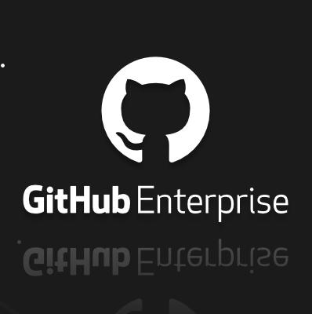
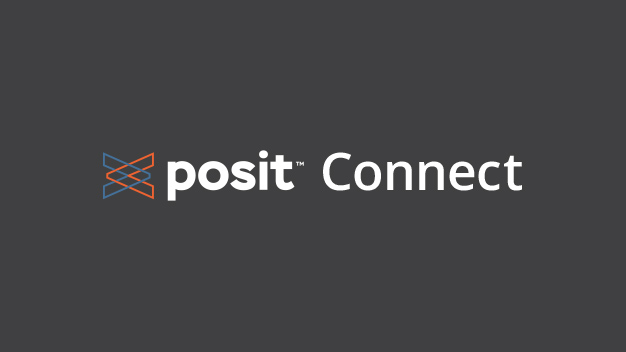
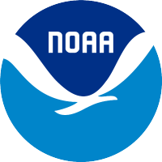

```{r setup, include=FALSE}
knitr::opts_chunk$set(echo = FALSE)
```

See the [NMFS Open Science internal website](https://sites.google.com/noaa.gov/nmfs-hq-st-open-science/open-science) (NOAA only) for the full list of Open Science communities across NOAA Fisheries. The following communities provide much of the leadership and direction for NMFS Open Science activities.

| [NMFS Openscapes](https://nmfs-openscapes.github.io) | [NOAA Fisheries Integrated Toolbox](https://noaa-fisheries-integrated-toolbox.github.io/) | [NOAA Fisheries Integrated Modeling System](https://noaa-fims.github.io/) | [NMFS R User Group](https://nmfs-opensci.github.io/NMFS-R-UG/) |
| :------: | :----: | :----: | :----: |
| <a href="https://nmfs-openscapes.github.io"></a> | <a href="https://noaa-fisheries-integrated-toolbox.github.io/"></a> | <a href="https://noaa-fims.github.io/"></a> | <a href="https://nmfs-opensci.github.io/NMFS-R-UG/"></a> |
| Openscapes’ training helps teams transition to robust, inclusive, and enduring science- and data-driven solutions to global and time-sensitive challenges. | The NOAA Fisheries Integrated Toolbox (NOAA FIT) is an interdisciplinary, web-based portal of operational tools. | The NOAA Fisheries Integrated Modeling System is designed to support next-generation fisheries stock assessment, ecosystem, and socioeconomic modeling. | The NMFS R User Group supports R users across NOAA Fisheries. |
| <a href="https://sites.google.com/noaa.gov/nmfs-st-github-governance-team/home"></a> | <a href=""></a> | <a href="https://github.com/nmfs-ost"></a> |  |
| The GitHub Governance Team is a collaborative science end-user and IT admin team that governs GitHub Enterprise at NMFS. | The Posit Connect Group manages and governs our Posit Connect instance. | Data scientists at Office of Science and Technology lead a variety of data science and Open Science trainings. |  |
